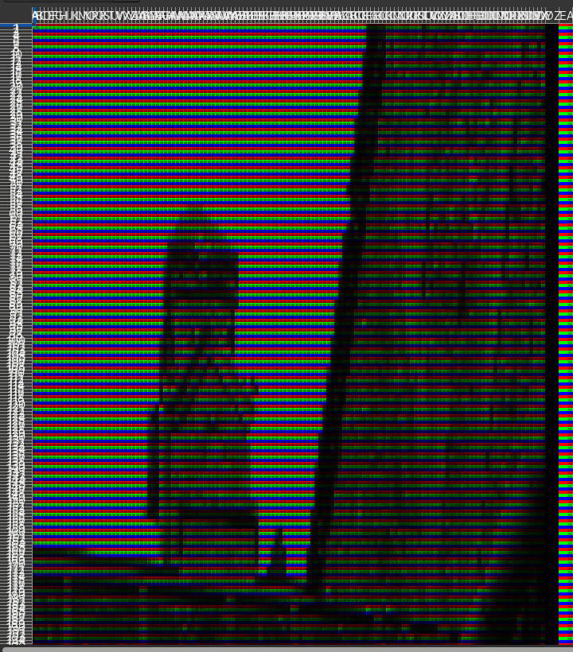

# image2excel <!-- omit in toc -->
A program which converts images into Excel spreadsheets written in Go.

Usage examples can be found in `cmd`.

---

- [Example conversion](#example-conversion)
- [Running image2excel](#running-image2excel)
- [Command line options](#command-line-options)
  - [-s,  --scalefactor](#-s----scalefactor)
  - [--width, --height](#--width---height)
- [TODO](#todo)

---

### Example conversion

**Original image:**


**Conversion:**



### Running image2excel

***Note**: There isn't a Windows build script so use WSL or build manually. It should still work correctly on Windows if build correctly though.*

Prequsites:
- Go (>= 1.20)

Instructions:

1. Clone the repository
```
$ git clone https://github.com/sccreeper/image2excel.git
```
1. Build the project
```
$ cd ./image2excel
$ ./build.sh
```
1. Run the program
```
cd ./build
./i2e -s 0.025 test_image.JPG
```

### Command line options

#### -s,  --scalefactor

Usage:
```
./i2e -s <float> <image>
```

This argument scales the width and height of the image by a float value. It is recommended that this value is below 1.0 and if the image resolution is >1000x1000 it be set to 0.025-0.05 or lower.

#### --width, --height

Usage
```
./i2e --width <integer>
```

```
./i2e --height <integer>
```

These arguements can be used instead of the scale factor arguement, although they are still affected by it. They can not be used as the same time as each other because the aspect ratio is maintained.

### TODO
 - Add video support
 - Add UI
